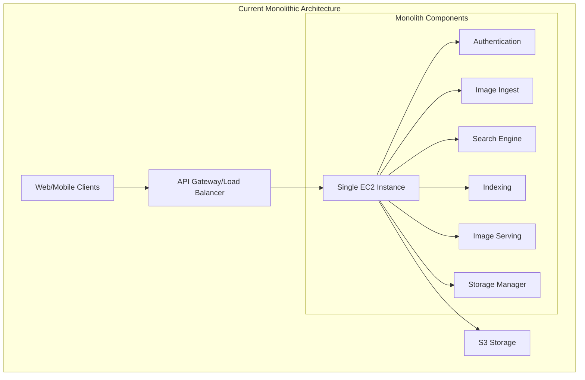
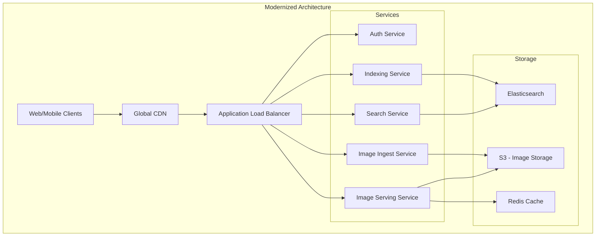
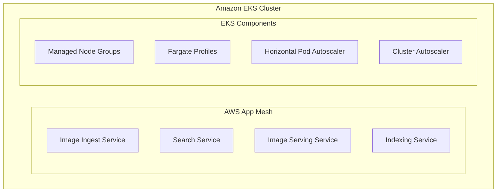

# System Evolution Documentation

## 1. Current System Architecture
The existing system operates as a monolithic application hosted on a single EC2 instance:

### Components
- Single EC2 instance hosting all services
- API Gateway/Load Balancer for traffic handling
- S3 Storage for image data
- Monolithic codebase containing:
  - Authentication system
  - Image ingestion service
  - Search engine
  - Indexing system
  - Image serving capability
  - Storage management
  - Third-party API integrations

### Limitations
- Limited scalability
- Single point of failure
- Tight coupling between components
- Difficult to maintain and update
- Resource constraints
- Limited deployment flexibility

## 2. Infrastructure Modernization

### Load Balancing Enhancement
- Implementation of Application Load Balancer (ALB)
- SSL/TLS termination
- Health checks implementation
- Traffic distribution capabilities

### Content Delivery
- Integration of Global CDN
- Edge caching for improved performance
- Reduced latency for global users
- Better handling of static assets

## 3. Service Decomposition

### Microservices Architecture
Each monolithic component is transformed into an independent service:

1. **Authentication Service**
   - User authentication and authorization
   - Token-based access management
   - Security policy enforcement

2. **Image Processing Services**
   - Image Ingestion Service
     - Upload handling
     - Image validation
     - Format processing
   
   - Image Serving Service
     - Optimized delivery
     - Format conversion
     - Resolution adaptation

3. **Search and Indexing**
   - Search Service
     - Query processing
     - Results ranking
     - Search optimization
   
   - Indexing Service
     - Metadata extraction
     - Index management
     - Tag processing

## 4. Storage Layer Enhancement

### Multi-tier Storage
1. **S3 Storage**
   - Raw image storage
   - Backup management
   - Lifecycle policies

2. **Caching Layer**
   - Redis implementation
   - Frequently accessed data caching
   - Performance optimization
   - Session management

3. **Search Database**
   - Elasticsearch integration
   - Full-text search capabilities
   - Metadata indexing

## 5. Container Orchestration

### Amazon EKS Implementation
- Kubernetes cluster management
- AWS App Mesh integration
- Service mesh capabilities
- Container orchestration

### Scaling Components
- Horizontal Pod Autoscaler
- Cluster Autoscaler
- Managed Node Groups
- Fargate Profiles for serverless containers

## 6. Observability Layer

### Monitoring
- Comprehensive metrics collection
- Performance monitoring
- Resource utilization tracking
- Custom dashboards

### Logging
- Centralized logging
- Log aggregation
- Error tracking
- Audit trails

### Tracing
- Distributed tracing
- Request flow visualization
- Latency analysis
- Bottleneck identification

## 7. Security Implementation

### Multi-layer Security
- Network security groups
- IAM roles and policies
- Service-to-service authentication
- Data encryption at rest and in transit

### Compliance
- Access control implementation
- Audit logging
- Security monitoring
- Compliance reporting

## 8. Cost Optimization

### Resource Management
- Auto-scaling policies
- Resource utilization monitoring
- Cost-effective storage solutions
- Performance vs. cost balancing

### Optimization Strategies
- Reserved instances utilization
- Spot instance implementation
- Storage tiering
- Cache optimization

## Implementation Timeline
1. Infrastructure setup and ALB implementation
2. CDN integration
3. Service decomposition (one service at a time)
4. Storage layer enhancement
5. Container orchestration setup
6. Observability implementation
7. Security measures deployment
8. Cost optimization implementation

## Benefits
- Improved scalability
- Better fault isolation
- Independent service deployment
- Enhanced monitoring
- Optimized resource utilization
- Reduced operational costs
- Improved developer productivity
- Better user experience

---
For detailed technical specifications and implementation guides, refer to the individual documentation files in the `/services` directory.
