# Our Journey: From Monolith to Modern Architecture

Hey there! This document walks you through our system's evolution from a single-server monolith to a scalable, cloud-native powerhouse. Whether you're a developer, architect, or stakeholder, you'll find everything you need to understand our transformation journey.

## Quick Navigation
1. [Where We Started](#1-where-we-started)
   - [Current Setup](#what-we-have-now)
   - [Pain Points](#pain-points-were-solving)

2. [Our Transformation Plan](#2-our-transformation-plan)
   - [Game Plan](#our-game-plan)
   - [Expected Benefits](#what-well-gain)

3. [Infrastructure Modernization](#3-infrastructure-modernization)
   - [Frontend Layer](#frontend-layer)
   - [Authentication Layer](#authentication-layer)

4. [Service Decomposition](#4-service-decomposition)
   - [Architecture Overview](#proposed-architecture-overview)
   - [Request Flow](#request-flow)
   - [Service Communication](#service-communication-architecture)
   - [Core Services](#core-services)

5. [Implementation Details](#5-implementation-details)
   - [Storage Layer](#storage-layer)
   - [Container Orchestration](#container-orchestration)
   - [Observability](#observability-layer)
   - [Security](#security-implementation)
   - [Cost Optimization](#cost-optimization)

6. [Deep Dive: Discussion Points](#lets-talk-key-discussion-points)
   - [Scaling Strategy](#1-scaling-like-a-pro)
   - [Third-Party Services](#2-going-beyond-aws)
   - [Zero-Downtime Strategy](#3-zero-downtime-no-sweat)
   - [Infrastructure as Code](#4-infrastructure-as-code-ftw)
   - [Monitoring Approach](#5-keep-your-eyes-on-the-prize)
   - [Developer Access](#6-developer-access-made-safe)
   - [Storage Optimization](#7-smart-storage-happy-wallet)

7. [Additional Considerations](#additional-considerations)
   - [Service Mesh vs Istio](#service-mesh-vs-istio)
   - [EKS Components](#eks-components)
   - [Ruby on Rails Considerations](#ruby-on-rails-considerations)
   - [Scaling Strategy](#scaling-strategy)
   - [Network Architecture](#network-layer-architecture)
   - [Database Recommendations](#database-recommendations)

---

## 1. Where We Started

### Current Architecture
Let's look at our current setup - it's a classic monolith running on a single EC2 instance:

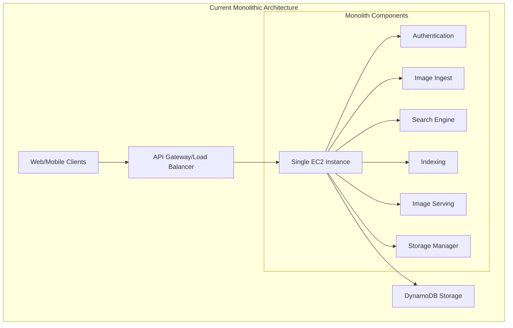

### What We Have Now
Here's what we're working with:
- Everything runs on one EC2 instance (yes, really!)
- We've got a basic Load Balancer handling traffic
- DynamoDB takes care of our data storage
- Our monolithic app includes:
  - Authentication system
  - Image ingestion service
  - Search engine
  - Image serving
  - Storage management
  - Third-party API integrations

### Pain Points We're Solving
- Can't scale when we need to
- If our server goes down, everything goes down
- All our code is tightly coupled - change one thing, worry about everything
- Updates are becoming a nightmare
- We're constantly running into resource limits
- Deployments are rigid and risky

## 2. Our Transformation Plan

### Our Game Plan
Here's how we'll tackle this transformation:
1. First up: Setting up our new infrastructure backbone with ALB
2. Adding CDN for that sweet performance boost
3. Breaking down our monolith, one service at a time
4. Supercharging our storage layer
5. Getting our container orchestra playing in harmony
6. Adding eyes and ears to our system (observability)
7. Locking everything down tight (security)
8. Making sure we're not breaking the bank (cost optimization)

### What We'll Gain
Here's what makes this journey worth it:
- Scale up or down instantly based on demand
- Problems in one service won't crash everything else
- Deploy updates without sweating bullets
- See exactly what's happening in our system
- Use (and pay for) only what we need
- Keep costs under control
- Happy developers who can ship faster
- Lightning-fast experience for our users

## 3. Infrastructure Modernization

### Frontend Layer
Let's start with modernizing how users interact with our system. Here's our new frontend architecture:

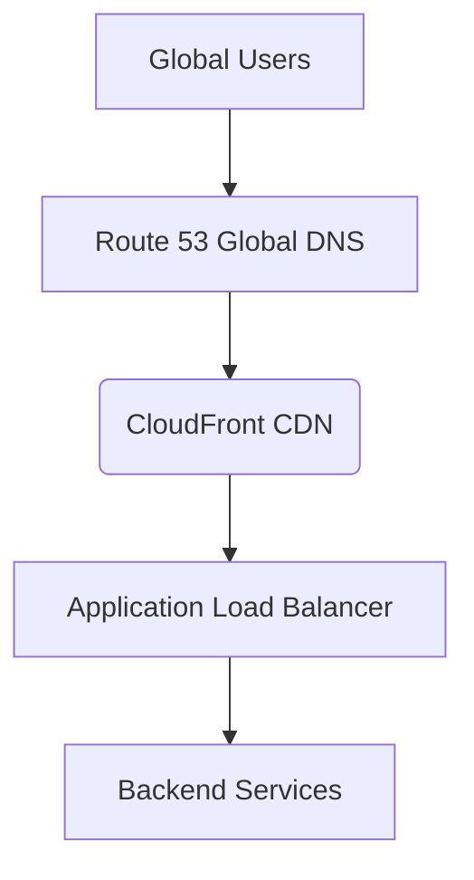

#### Components
1. **Global DNS (Route 53)**
   - Global DNS service for routing
   - Health checks and failover
   - Latency-based routing

2. **Content Delivery Network (CloudFront)**
   - Edge caching for improved performance
   - Global content delivery
   - DDoS protection with Shield
   - Static asset optimization

3. **Load Balancing (ALB)**
   - SSL/TLS termination
   - Health checks implementation
   - Traffic distribution
   - Path-based routing

### Authentication Layer
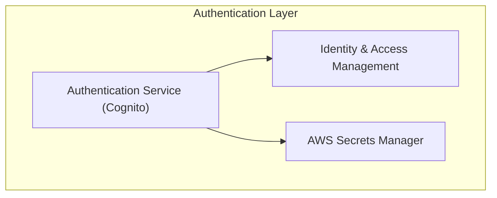

#### Security Components
1. **Authentication Service (Cognito)**
   - User authentication and authorization
   - Token-based access management
   - Social identity providers

2. **Identity Management**
   - IAM roles and policies
   - Fine-grained access control
   - Secrets management

## 3. Service Decomposition

### Proposed Architecture Overview
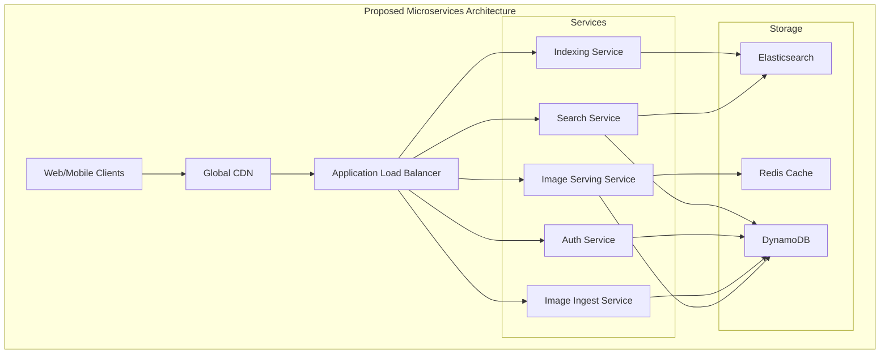

### Request Flow
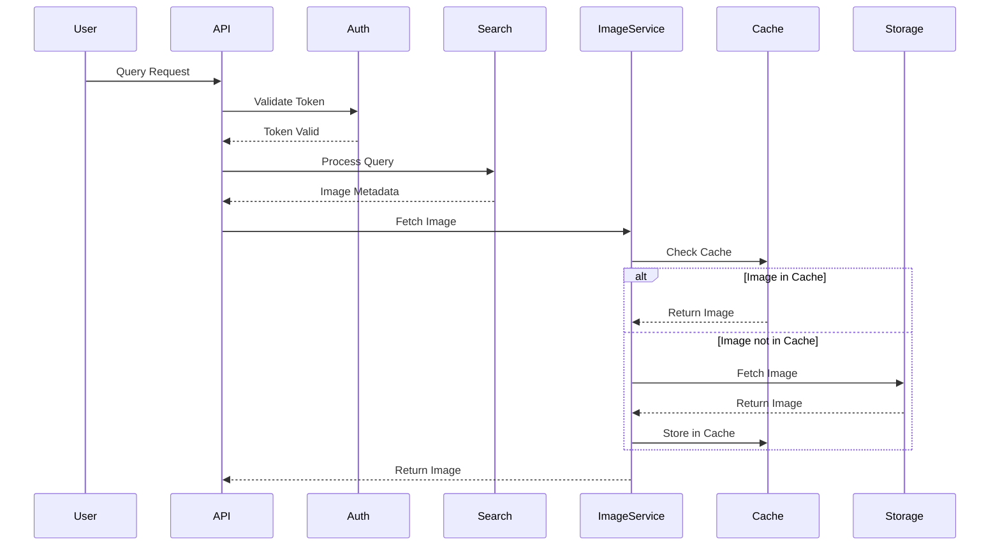

### Service Communication Architecture
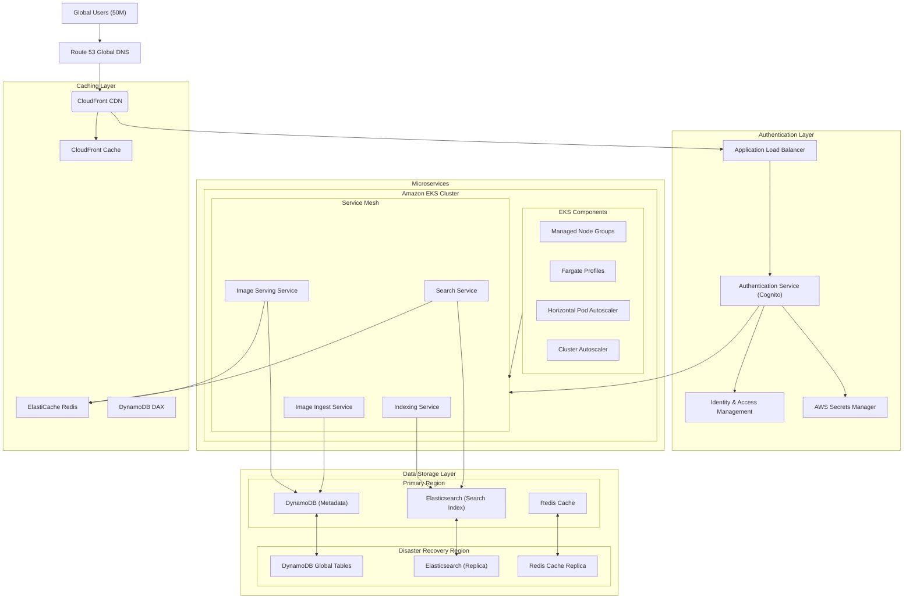

### Microservices Architecture
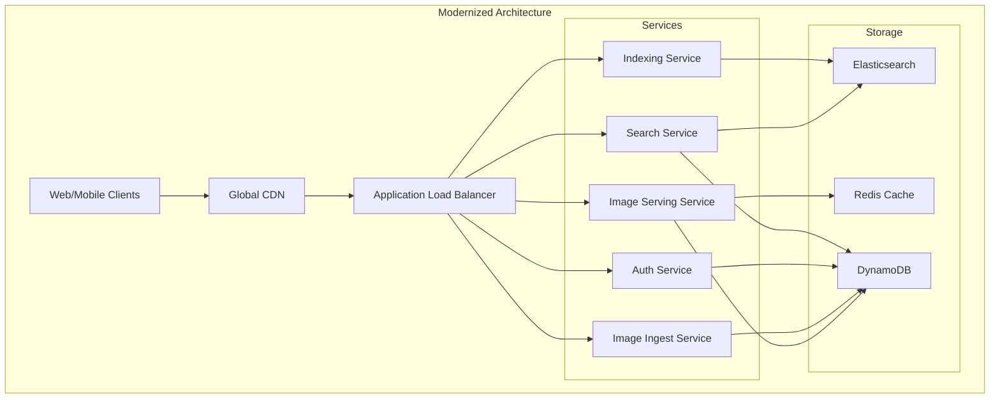

### EKS Cluster Architecture
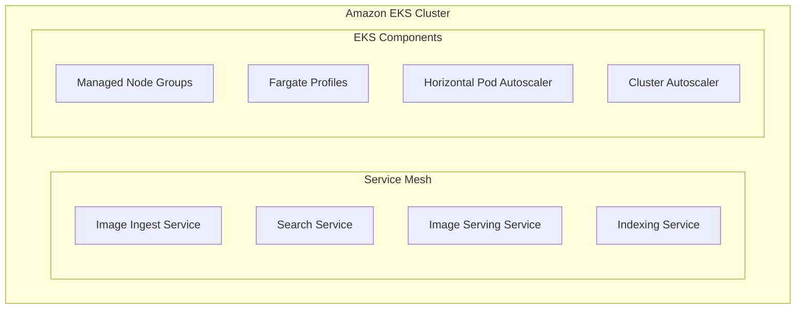

## 4. Storage Layer Enhancement

### Caching Infrastructure
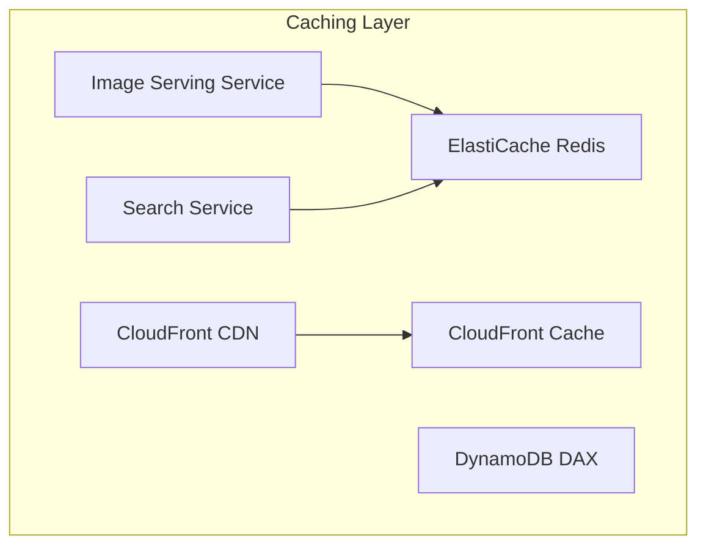

#### Caching Components
1. **Application Cache (ElastiCache Redis)**
   - Session management
   - Frequently accessed data
   - Real-time analytics
   - Pub/sub messaging

2. **CDN Cache (CloudFront)**
   - Edge location caching
   - Static asset optimization
   - Dynamic content caching

3. **Database Cache (DAX)**
   - DynamoDB acceleration
   - Microsecond latency
   - Write-through caching

### Data Storage Architecture
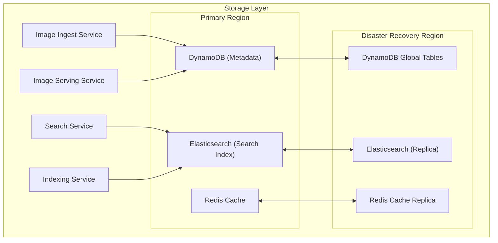

### Storage Components
1. **Data Storage (DynamoDB)**
   - Metadata storage
   - Cross-region replication
   - Auto-scaling
   - Point-in-time recovery

2. **Search Engine (Elasticsearch)**
   - Full-text search
   - Analytics capabilities
   - Cross-region replication

3. **Caching Layer (Redis)**
   - Session management
   - Frequently accessed data
   - Real-time analytics
   - Pub/sub messaging

### Cost Optimization
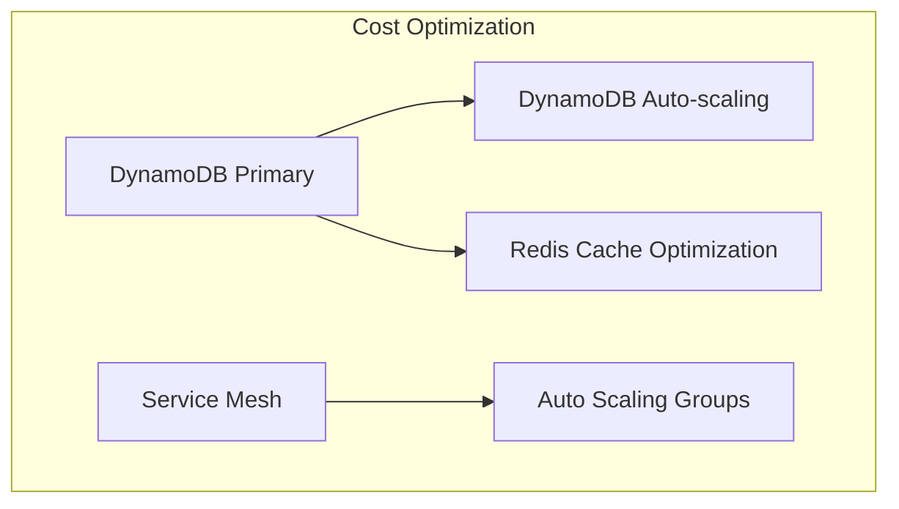

### Cost Management Components
1. **Storage Optimization**
   - DynamoDB auto-scaling
   - Redis Cache optimization
   - EBS volume optimization
   - RDS storage optimization

2. **Compute Optimization**
   - Auto Scaling Groups
   - Spot Instance usage
   - Reserved Instance planning
   - Resource right-sizing

### Cost Control Strategies
1. **Resource Management**
   - Utilization monitoring
   - Cost allocation tags
   - Budget alerts
   - Usage analytics

2. **Performance Optimization**
   - Cache utilization
   - Query optimization
   - Traffic management
   - Resource scheduling

## 5. Container Orchestration

### Amazon EKS Implementation
- Kubernetes cluster management
- AWS App Mesh integration
- Service mesh capabilities
- Container orchestration

### Scaling Components
- Horizontal Pod Autoscaler
- Cluster Autoscaler
- Managed Node Groups
- Fargate Profiles for serverless containers

## 6. Observability Layer

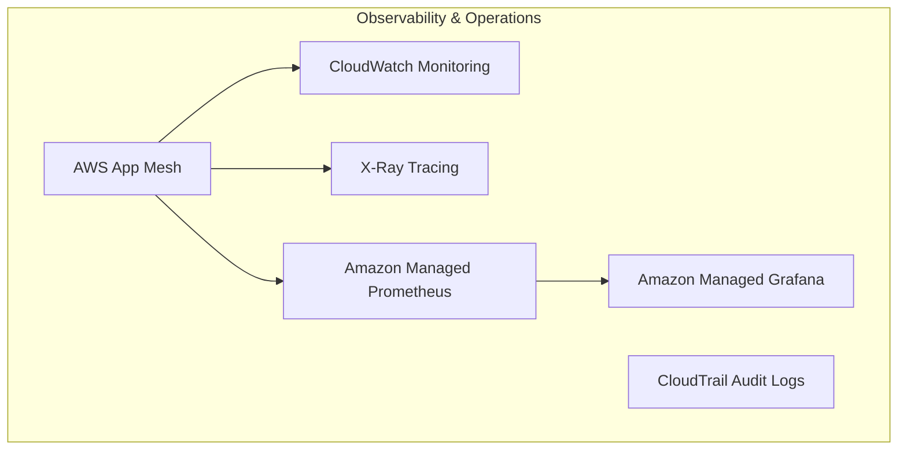

### Monitoring Components
1. **Metrics Collection**
   - CloudWatch metrics
   - Custom metrics
   - Resource utilization
   - Performance metrics
   - Prometheus metrics

2. **Visualization**
   - Grafana dashboards
   - Real-time monitoring
   - Custom alerts
   - Trend analysis

### Logging Infrastructure
1. **Log Aggregation**
   - Centralized logging
   - Log analytics
   - Error tracking
   - Pattern detection

2. **Audit System**
   - CloudTrail logs
   - Security auditing
   - Compliance reporting
   - Access tracking

### Distributed Tracing
1. **X-Ray Implementation**
   - Request tracing
   - Latency analysis
   - Error detection
   - Service map

2. **Service Mesh Monitoring**
   - App Mesh metrics
   - Service-to-service communication
   - Traffic flow analysis
   - Performance optimization

## 7. Security Implementation

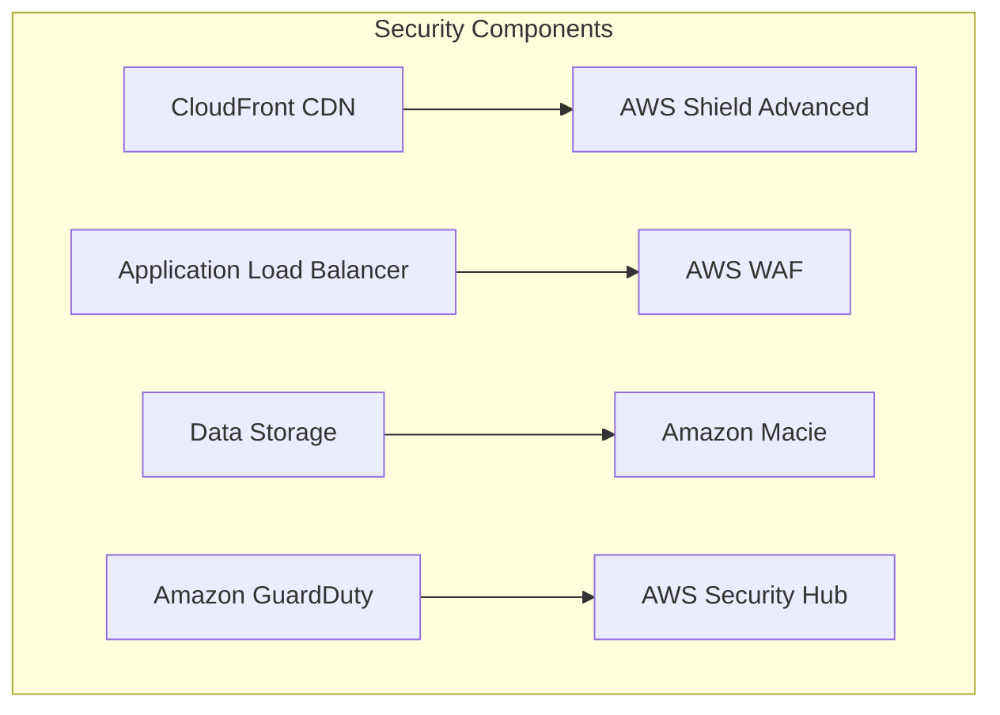

### Security Components
1. **Edge Security**
   - AWS Shield Advanced for DDoS protection
   - WAF rules and filtering
   - Edge location protection
   - Traffic inspection

2. **Threat Detection**
   - GuardDuty for threat detection
   - Security Hub integration
   - Automated response
   - Incident management

3. **Data Security**
   - Macie for data discovery
   - Data classification
   - PII detection
   - Compliance monitoring

### Compliance Framework
1. **Access Control**
   - IAM policies
   - Service roles
   - Resource-based policies
   - Permission boundaries

2. **Audit System**
   - CloudTrail logging
   - Security monitoring
   - Compliance reporting
   - Access tracking

## 8. Cost Optimization

### Cost Management Components
1. **Storage Optimization**
   - DynamoDB auto-scaling
   - Redis Cache optimization
   - EBS volume optimization
   - RDS storage optimization

2. **Compute Optimization**
   - Auto Scaling Groups
   - Spot Instance usage
   - Reserved Instance planning
   - Resource right-sizing

### Cost Control Strategies
1. **Resource Management**
   - Utilization monitoring
   - Cost allocation tags
   - Budget alerts
   - Usage analytics

2. **Performance Optimization**
   - Cache utilization
   - Query optimization
   - Traffic management
   - Resource scheduling

## Our Game Plan
Here's how we'll tackle this transformation:
1. First up: Setting up our new infrastructure backbone with ALB
2. Adding CDN for that sweet performance boost
3. Breaking down our monolith, one service at a time
4. Supercharging our storage layer
5. Getting our container orchestra playing in harmony
6. Adding eyes and ears to our system (observability)
7. Locking everything down tight (security)
8. Making sure we're not breaking the bank (cost optimization)

## What We'll Gain
Here's what makes this journey worth it:
- Scale up or down instantly based on demand
- Problems in one service won't crash everything else
- Deploy updates without sweating bullets
- See exactly what's happening in our system
- Use (and pay for) only what we need
- Keep costs under control
- Happy developers who can ship faster
- Lightning-fast experience for our users

## Let's Talk: Key Discussion Points

### 1. Scaling Like a Pro

Our infrastructure scales both horizontally and vertically based on real-world usage patterns. Here's what triggers our scaling:

#### Scaling Metrics
- **CPU Utilization** > 70% for 2 minutes
- **Memory Usage** > 80% for 2 minutes
- **Request Count** > 1000 requests/second
- **Response Time** > 500ms for 95th percentile
- **Queue Length** > 100 messages

Each service has its own scaling rules:
- Image Processing: CPU and memory usage
- Search Service: Query latency and queue depth
- Auth Service: Request count and active sessions
- Storage Service: IOPS and throughput

### 2. Going Beyond AWS?

Yep, we do step outside the AWS ecosystem when it makes sense! Here's where and why:

#### Third-Party Services We Use
- **Cloudflare** for DDoS protection and edge caching
  - *Why?* Better global presence and specialized security features
  - *Trade-off:* Additional cost vs. AWS Shield, but better protection

- **Elasticsearch Cloud** for search functionality
  - *Why?* Managed service expertise and easier scaling
  - *Trade-off:* Higher cost than self-managed OpenSearch, but less operational overhead

- **DataDog** for advanced monitoring
  - *Why?* Better visualization and AI-driven insights
  - *Trade-off:* More expensive than CloudWatch, but more powerful features

### 3. Zero-Downtime? No Sweat!

Here's our zero-downtime deployment strategy:

1. **Blue-Green Deployments**
   - Maintain two identical environments
   - Test new version in 'Green'
   - Switch traffic gradually using Route53 weighted routing

2. **Rolling Updates in EKS**
   - Update one pod at a time
   - Health checks before adding to load balancer
   - Automatic rollback if health checks fail

### 4. Infrastructure as Code FTW!

#### How We Manage It
- **Terraform** for infrastructure provisioning
- **Helm** for Kubernetes deployments
- **GitHub Actions** for CI/CD
- **AWS CDK** for application resources

#### Multi-Cloud/Region Support

**Different Providers? Absolutely!**
- Infrastructure code is provider-agnostic
- Use of standard Docker containers
- Abstract provider-specific services

**Multi-Region? You Bet!**
- Active-Active setup in multiple regions
- Global Route53 for traffic distribution
- Cross-region data replication
- Regional auto-scaling groups

### 5. Keep Your Eyes on the Prize

#### Critical Metrics We Track
1. **User Experience**
   - Page load time
   - API response time
   - Error rates
   - User session duration

2. **System Health**
   - Service availability
   - Resource utilization
   - Cache hit rates
   - Queue depths

3. **Business Metrics**
   - Successful transactions
   - Active users
   - Storage usage
   - Cost per request

#### Our Monitoring Stack
- DataDog for application monitoring
- ELK Stack for log analysis
- Grafana for visualization
- PagerDuty for alerting

### 6. Developer Access Made Safe

Here's how our devs get in:

1. **Access Layers**
   - AWS SSO integration
   - Role-based access control
   - Time-based access tokens
   - VPN requirement for sensitive operations

2. **Development Tools**
   - kubectl with EKS authentication
   - AWS Cloud9 for cloud-based IDE
   - Bastion hosts for direct access
   - Local development environments with Docker

### 7. Smart Storage, Happy Wallet

#### Cost Optimization Strategies
1. **S3 Lifecycle Management**
   - Frequently accessed data → Standard storage
   - After 30 days → Infrequent Access
   - After 90 days → Glacier
   - Delete after 1 year (configurable)

2. **Intelligent Tiering**
   - Automatic movement between tiers
   - Pattern-based optimization
   - Cost analysis and recommendations

3. **Cache Optimization**
   - Redis caching for hot data
   - CDN caching for static assets
   - Browser caching policies

4. **Data Compression**
   - Image compression on upload
   - Text compression for logs
   - Database compression

## Additional Considerations

### Service Mesh vs Istio
We chose Service Mesh over Istio for the following reasons:
1. Native AWS integration
2. Simpler management
3. Lower operational overhead
4. Better cost efficiency
5. AWS support and maintenance

### EKS Components
The listed EKS components are our planned implementation:
1. **Node Groups**
   - Managed node groups for worker nodes
   - Spot instances for cost optimization
   - On-demand instances for critical workloads

2. **Fargate Profiles**
   - Serverless compute for containers
   - Automatic scaling
   - Pay-per-use pricing

3. **Scaling Components**
   - Horizontal Pod Autoscaler
   - Cluster Autoscaler
   - Vertical Pod Autoscaler

### Ruby on Rails Considerations
For a Ruby on Rails application:
1. **Containerization**
   - Multi-stage Docker builds
   - Asset precompilation in build
   - Environment-specific configurations

2. **Database**
   - PostgreSQL on RDS
   - Redis for caching
   - Sidekiq for background jobs

3. **Deployment**
   - Zero-downtime deployments
   - Database migrations strategy
   - Asset pipeline optimization

### Scaling Strategy
1. **Load Balancer Level**
   - ALB in each region
   - Cross-zone load balancing
   - Health checks and failover

2. **Route 53**
   - Latency-based routing
   - Health checks
   - Failover routing

3. **Service Duplication**
   - DynamoDB Global Tables
   - RDS Read Replicas
   - Redis Cache Replication

### Network Architecture
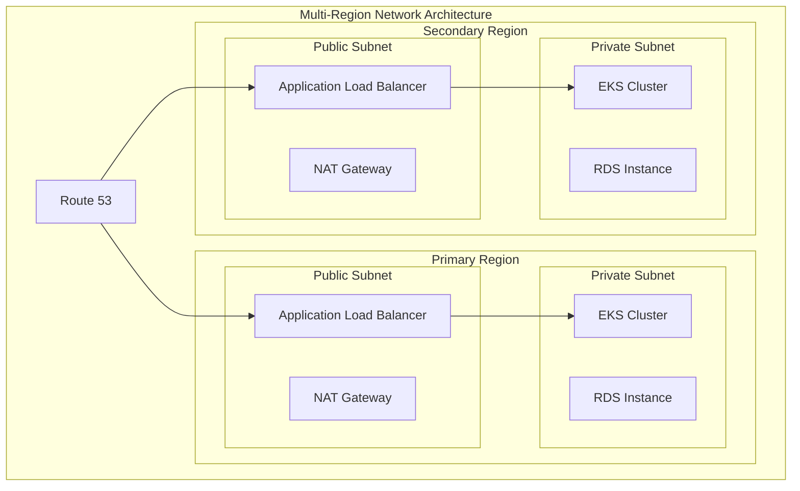

### Database Recommendations
1. **Primary Database (RDS)**
   - PostgreSQL for relational data
   - Multi-AZ deployment
   - Read replicas for scaling
   - Automated backups

2. **Hot Storage**
   - ElastiCache Redis for caching
   - DynamoDB for key-value storage
   - RDS for relational data

3. **Data Replication**
   - DynamoDB Global Tables for multi-region
   - RDS Read Replicas for read scaling
   - Redis Cache replication for high availability

4. **Backup Strategy**
   - Automated RDS snapshots
   - DynamoDB point-in-time recovery
   - Redis backup and restore
   - Cross-region replication

