# Our Journey: From Monolith to Modern Architecture

Hey there! 👋 This document walks you through our system's evolution from a single-server monolith to a scalable, cloud-native powerhouse. Whether you're a developer, architect, or stakeholder, you'll find everything you need to understand our transformation journey.

## Quick Navigation
1. [Current System Architecture](#1-current-system-architecture)
   - [Components](#components)
   - [Limitations](#limitations)

2. [Infrastructure Modernization](#2-infrastructure-modernization)
   - [Frontend Layer](#frontend-layer)
   - [Authentication Layer](#authentication-layer)

3. [Service Decomposition](#3-service-decomposition)
   - [Proposed Architecture Overview](#proposed-architecture-overview)
   - [Request Flow](#request-flow)
   - [Service Communication Architecture](#service-communication-architecture)
   - [Microservices Architecture](#microservices-architecture)
   - [Service Components](#core-services)

4. [Storage Layer Enhancement](#4-storage-layer-enhancement)
   - [Caching Infrastructure](#caching-infrastructure)
   - [Data Storage Architecture](#data-storage-architecture)

5. [Container Orchestration](#5-container-orchestration)
   - [Amazon EKS Implementation](#amazon-eks-implementation)
   - [Scaling Components](#scaling-components)

6. [Observability Layer](#6-observability-layer)
   - [Monitoring Components](#monitoring-components)
   - [Logging Infrastructure](#logging-infrastructure)
   - [Distributed Tracing](#distributed-tracing)

7. [Security Implementation](#7-security-implementation)
   - [Security Components](#security-components-1)
   - [Compliance Framework](#compliance-framework)

8. [Cost Optimization](#8-cost-optimization)
   - [Cost Management](#cost-management-components)
   - [Cost Control Strategies](#cost-control-strategies)

9. [Implementation Timeline](#implementation-timeline)

10. [Benefits](#benefits)

---

## 1. Where We Started
Let's look at our current setup - it's a classic monolith running on a single EC2 instance. While it's served us well, we've hit some growing pains:

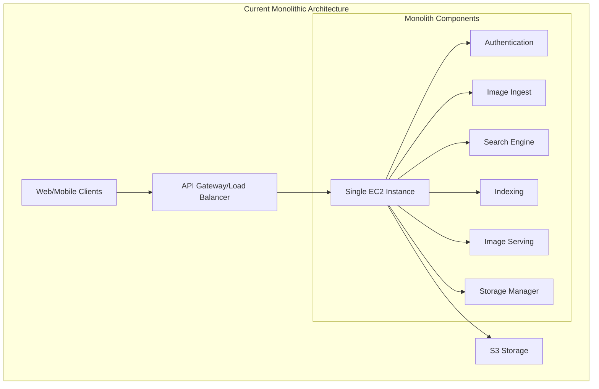

### What We Have Now
Here's what we're working with:
- Everything runs on one EC2 instance (yes, really!) 🏢
- We've got a basic API Gateway/Load Balancer handling traffic
- S3 takes care of our image storage
- Our monolithic app includes:
  - Authentication system
  - Image ingestion service
  - Search engine
  - Indexing system
  - Image serving capability
  - Storage management
  - Third-party API integrations

### Pain Points We're Solving
- Can't scale when we need to 😓
- If our server goes down, everything goes down
- All our code is tightly coupled - change one thing, worry about everything
- Updates are becoming a nightmare
- We're constantly running into resource limits
- Deployments are rigid and risky

## 2. The Transformation Begins
Here's how we're leveling up our infrastructure:

### Frontend Layer
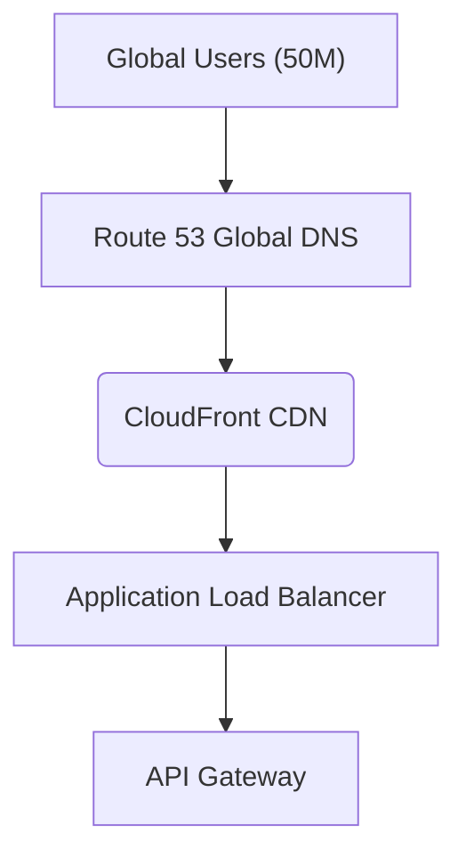

#### Components
1. **Global DNS (Route 53)**
   - Global DNS service for routing
   - Health checks and failover
   - Latency-based routing

2. **Content Delivery Network (CloudFront)**
   - Edge caching for improved performance
   - Global content delivery
   - DDoS protection with Shield
   - Static asset optimization

3. **Load Balancing (ALB)**
   - SSL/TLS termination
   - Health checks implementation
   - Traffic distribution
   - Path-based routing

### Authentication Layer
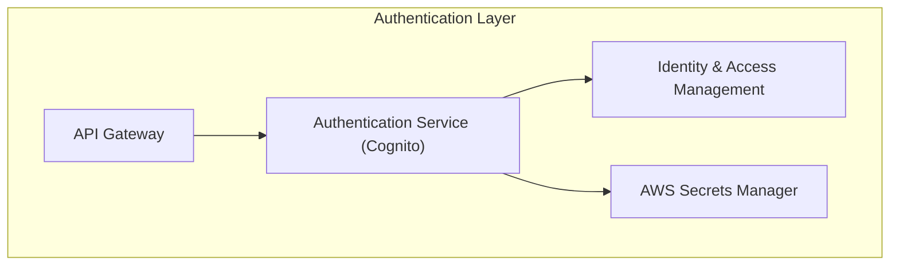

#### Security Components
1. **Authentication Service (Cognito)**
   - User authentication and authorization
   - Token-based access management
   - Social identity providers

2. **Identity Management**
   - IAM roles and policies
   - Fine-grained access control
   - Secrets management

## 3. Service Decomposition

### Proposed Architecture Overview
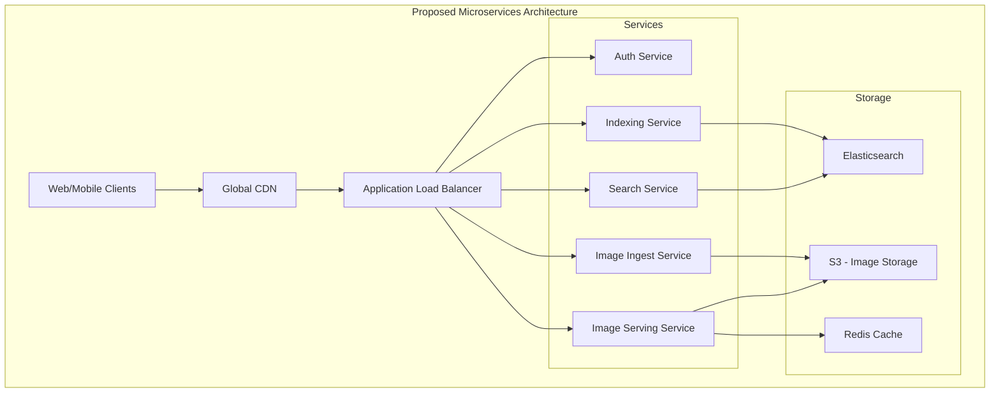

### Request Flow
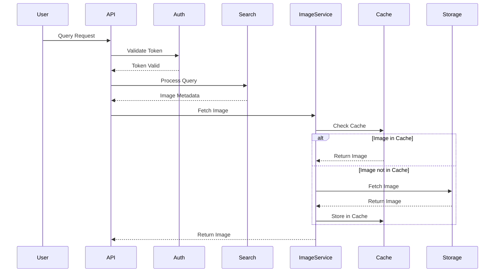

### Service Communication Architecture
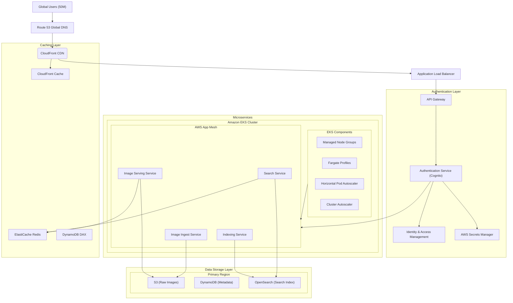

### Microservices Architecture
Each monolithic component is transformed into an independent service:

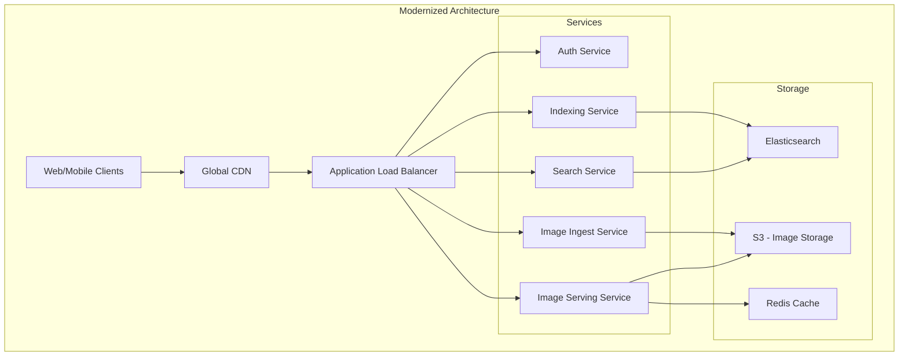

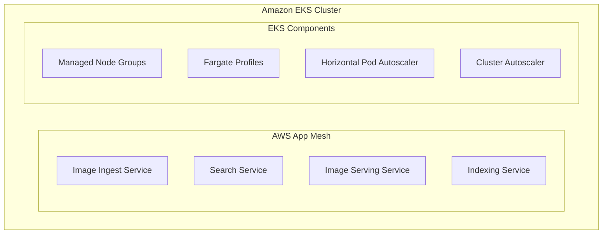

1. **Authentication Service**
   - User authentication and authorization
   - Token-based access management
   - Security policy enforcement

2. **Image Processing Services**
   - Image Ingestion Service
     - Upload handling
     - Image validation
     - Format processing
   
   - Image Serving Service
     - Optimized delivery
     - Format conversion
     - Resolution adaptation

3. **Search and Indexing**
   - Search Service
     - Query processing
     - Results ranking
     - Search optimization
   
   - Indexing Service
     - Metadata extraction
     - Index management
     - Tag processing

## 4. Storage Layer Enhancement

### Caching Infrastructure
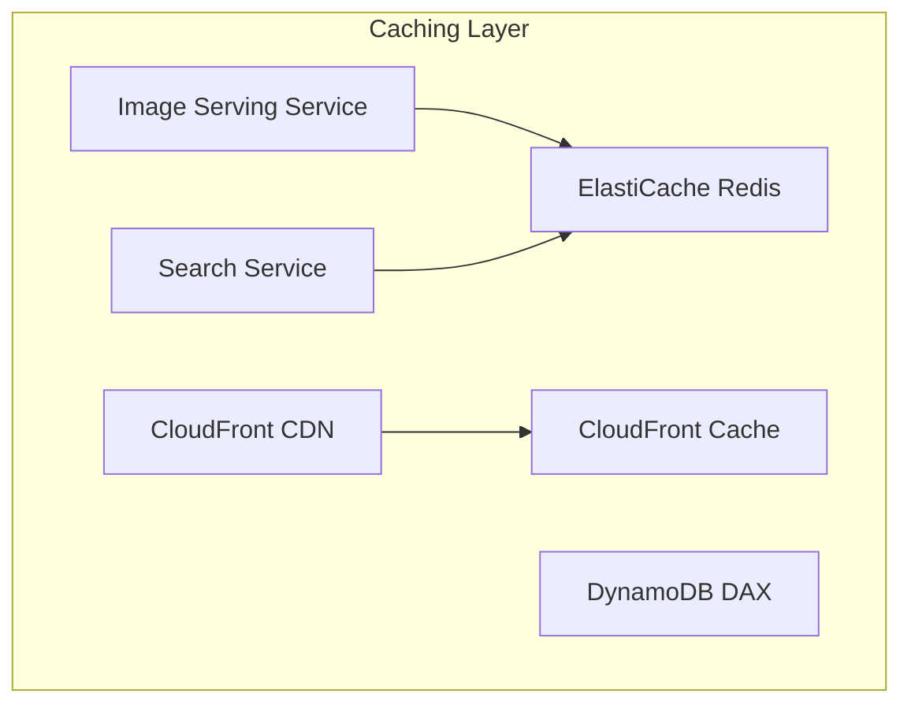

#### Caching Components
1. **Application Cache (ElastiCache Redis)**
   - Session management
   - Frequently accessed data
   - Real-time analytics
   - Pub/sub messaging

2. **CDN Cache (CloudFront)**
   - Edge location caching
   - Static asset optimization
   - Dynamic content caching

3. **Database Cache (DAX)**
   - DynamoDB acceleration
   - Microsecond latency
   - Write-through caching

### Data Storage Architecture
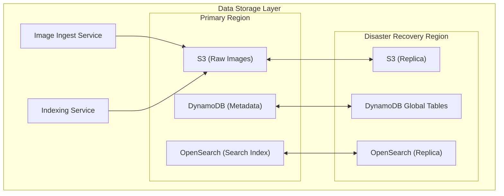

#### Storage Components
1. **Object Storage (S3)**
   - Raw image storage
   - Cross-region replication
   - Lifecycle management
   - Intelligent tiering

2. **Metadata Store (DynamoDB)**
   - Global tables for replication
   - Auto-scaling
   - Point-in-time recovery

3. **Search Engine (OpenSearch)**
   - Full-text search
   - Analytics capabilities
   - Cross-region replication

## 5. Container Orchestration

### Amazon EKS Implementation
- Kubernetes cluster management
- AWS App Mesh integration
- Service mesh capabilities
- Container orchestration

### Scaling Components
- Horizontal Pod Autoscaler
- Cluster Autoscaler
- Managed Node Groups
- Fargate Profiles for serverless containers

## 6. Observability Layer

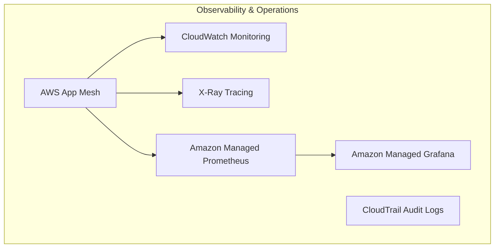

### Monitoring Components
1. **Metrics Collection**
   - CloudWatch metrics
   - Custom metrics
   - Resource utilization
   - Performance metrics
   - Prometheus metrics

2. **Visualization**
   - Grafana dashboards
   - Real-time monitoring
   - Custom alerts
   - Trend analysis

### Logging Infrastructure
1. **Log Aggregation**
   - Centralized logging
   - Log analytics
   - Error tracking
   - Pattern detection

2. **Audit System**
   - CloudTrail logs
   - Security auditing
   - Compliance reporting
   - Access tracking

### Distributed Tracing
1. **X-Ray Implementation**
   - Request tracing
   - Latency analysis
   - Error detection
   - Service map

2. **Service Mesh Monitoring**
   - App Mesh metrics
   - Service-to-service communication
   - Traffic flow analysis
   - Performance optimization

## 7. Security Implementation

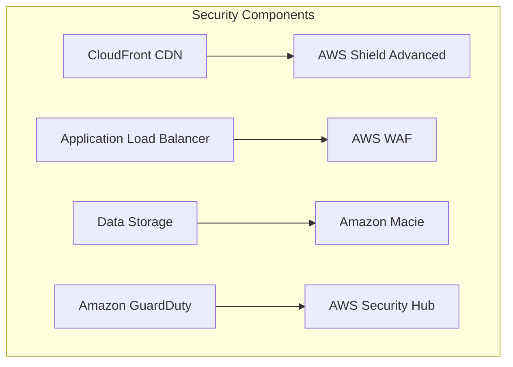

### Security Components
1. **Edge Security**
   - AWS Shield Advanced for DDoS protection
   - WAF rules and filtering
   - Edge location protection
   - Traffic inspection

2. **Threat Detection**
   - GuardDuty for threat detection
   - Security Hub integration
   - Automated response
   - Incident management

3. **Data Security**
   - Macie for data discovery
   - Data classification
   - PII detection
   - Compliance monitoring

### Compliance Framework
1. **Access Control**
   - IAM policies
   - Service roles
   - Resource-based policies
   - Permission boundaries

2. **Audit System**
   - CloudTrail logging
   - Security monitoring
   - Compliance reporting
   - Access tracking

## 8. Cost Optimization

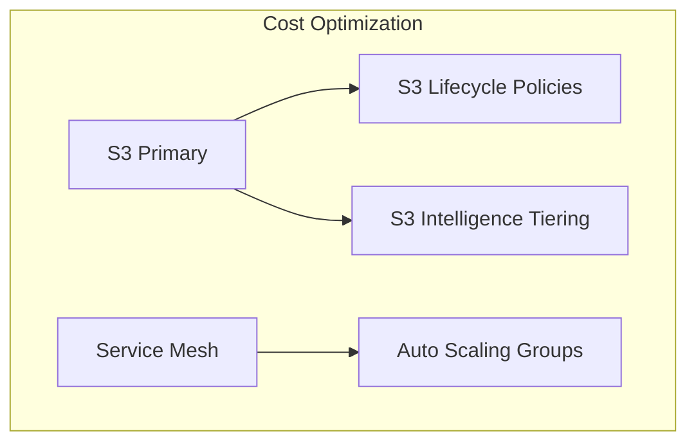

### Cost Management Components
1. **Storage Optimization**
   - S3 Lifecycle Policies
   - Intelligent Tiering
   - Storage class analysis
   - Automatic archival

2. **Compute Optimization**
   - Auto Scaling Groups
   - Spot Instance usage
   - Reserved Instance planning
   - Resource right-sizing

### Cost Control Strategies
1. **Resource Management**
   - Utilization monitoring
   - Cost allocation tags
   - Budget alerts
   - Usage analytics

2. **Performance Optimization**
   - Cache utilization
   - Query optimization
   - Traffic management
   - Resource scheduling

## Our Game Plan
Here's how we'll tackle this transformation:
1. First up: Setting up our new infrastructure backbone with ALB 🏗️
2. Adding CDN for that sweet performance boost 🚀
3. Breaking down our monolith, one service at a time 🔨
4. Supercharging our storage layer 💾
5. Getting our container orchestra playing in harmony 🎵
6. Adding eyes and ears to our system (observability) 👀
7. Locking everything down tight (security) 🔒
8. Making sure we're not breaking the bank (cost optimization) 💰

## What We'll Gain
Here's what makes this journey worth it:
- Scale up or down instantly based on demand 📈
- Problems in one service won't crash everything else 🛡️
- Deploy updates without sweating bullets 🎯
- See exactly what's happening in our system 🔍
- Use (and pay for) only what we need 💡
- Keep costs under control 💰
- Happy developers who can ship faster 🚀
- Lightning-fast experience for our users ⚡

---
For detailed technical specifications and implementation guides, refer to the individual documentation files in the `/services` directory.
