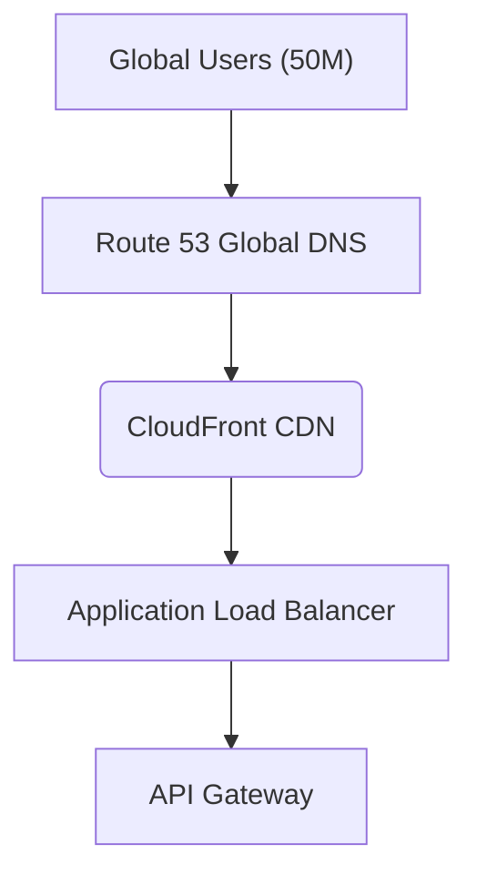

# Frontend Layer
This diagram shows the frontend request flow:
1. Users access the system through Route 53 (DNS service)
2. Requests are routed to CloudFront CDN for content delivery
3. Application Load Balancer distributes traffic
4. API Gateway manages API requests
