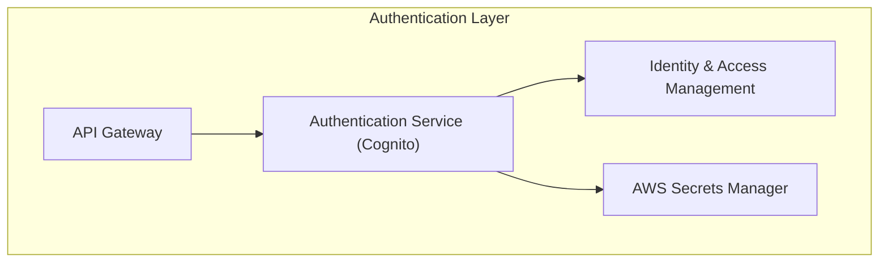

# Authentication Layer
This diagram shows the authentication components:
1. API Gateway forwards requests to Authentication Service (AWS Cognito)
2. Authentication Service interacts with IAM for access control
3. Secrets Manager handles sensitive information
