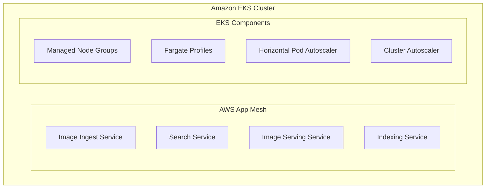

# Microservices Layer
This diagram shows the microservices architecture:
1. All services run in Amazon EKS (Kubernetes) cluster
2. Services are managed by AWS App Mesh for service mesh capabilities
3. Core services include:
   - Image Ingest Service
   - Search Service
   - Image Serving Service
   - Indexing Service
4. EKS infrastructure components:
   - Managed Node Groups for container hosting
   - Fargate Profiles for serverless containers
   - Horizontal Pod Autoscaler for scaling
   - Cluster Autoscaler for node scaling
