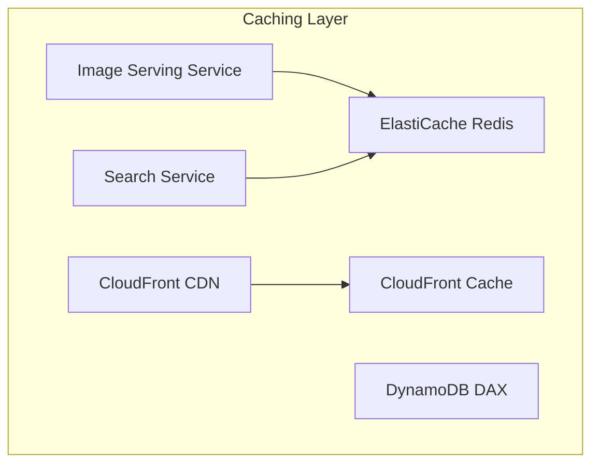

# Caching Layer
This diagram shows the caching infrastructure:
1. ElastiCache Redis for application-level caching
2. CloudFront Cache for CDN-level caching
3. DynamoDB DAX for database caching
4. Services interact with caches to improve performance
