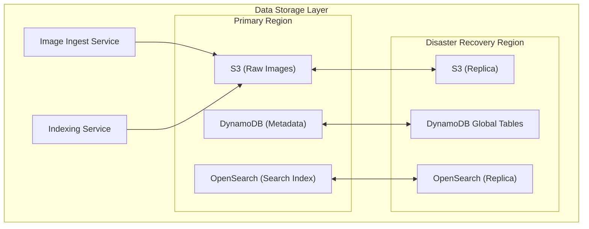

# Data Storage Layer
This diagram shows the data storage architecture:
1. Primary Region:
   - S3 for raw image storage
   - DynamoDB for metadata
   - OpenSearch for search indexing
2. Disaster Recovery Region with replicas
3. Cross-region replication for high availability
