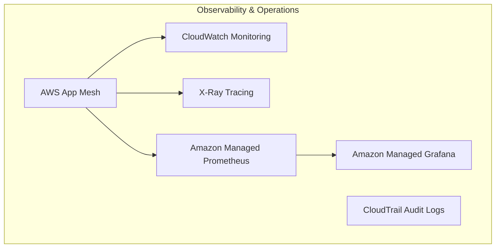

# Observability Layer
This diagram shows the monitoring and observability setup:
1. CloudWatch for monitoring and logging
2. X-Ray for distributed tracing
3. CloudTrail for audit logging
4. Prometheus for metrics collection
5. Grafana for metrics visualization
