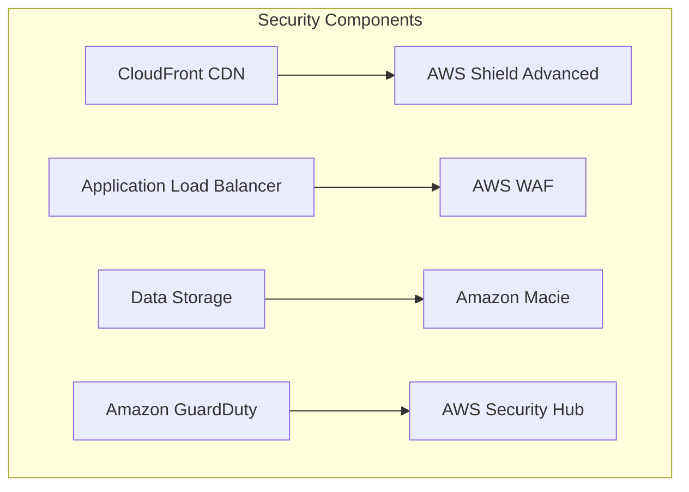

# Security Layer
This diagram shows the security components:
1. AWS Shield Advanced for DDoS protection
2. WAF for web application firewall
3. GuardDuty for threat detection
4. Security Hub for security management
5. Macie for data security
