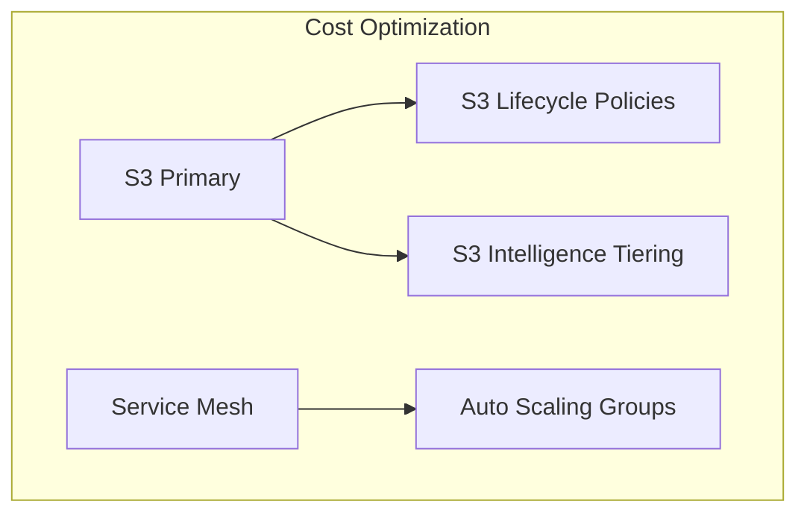

# Cost Optimization Layer
This diagram shows cost optimization features:
1. S3 Lifecycle Policies for data lifecycle management
2. Auto Scaling Groups for resource optimization
3. S3 Intelligence Tiering for storage cost optimization
